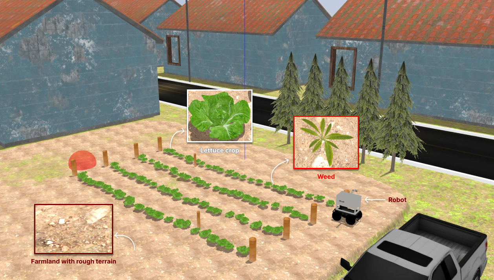

# Introduction

## Phase 1: Simulation

Dans cette phase de simulation uniquement, les équipes travailleraient à fournir des solutions à deux (2) tâches fondamentales d'un robot de livraison qui sont:

* Navigation sur le terrain autonome
* Estimation du rendement des cultures

La plate-forme de simulation à utiliser dans cette phase est le [simulateur de gazebo](https://classic.gazebosim.org/tutorials?tut=install_ubuntu&cat=install). Les équipes doivent développer, tester et soumettre des logiciels pour accomplir avec succès ces tâches de manière autonome. Cette phase évaluera les capacités des équipes pour accomplir avec succès ces tâches fondamentales requises pour rivaliser dans la phase 2 (sur le robot physique).

Chaque tâche est conçue comme autonome, sans en fonction des autres fonctionnalités de la tâche, par conséquent, nous demandons aux équipes de terminer les tâches séparément. Les tâches seraient évaluées individuellement et le score total de l'équipe pour cette phase serait la somme des scores de tâches individuels.

Les équipes reçoivent des packages ROS et des modèles d'environnement de gazebo **PARC AgRobot** (voir des description ci-dessous) pour leur permettre de développer et de tester leurs solutions (voir [Github Repository](https://github.com/parc-robotics/parc-ingeneers-league)).

### The PARC AgRobot
Le **PARC AgRobot** (Robot agricole) est un véhicule au sol sans pilote (UGV) équipé de différents capteurs pour vous aider à atteindre votre objectif. Les capteurs sont:

* **YDLiDAR:** Un capteur lidar situé en haut de la base du robot. Le Ydlidar publie le sujet `/scan`.

* **RGB Camera (x2):** Deux caméras RVB orientées vers le bas sont fournies sur le côté gauche et droit du robot. Ces caméras sont suspendues via un surplomb et donne la vue supérieure des terres agricoles. Les sujets publiés par ces caméras ont des noms de groupe qui sont `/left_camera/` et `/right_camera/`.

* **ZED 2i Camera:** Il s'agit d'une caméra stéréo à l'avant de la base du robot. Il publie tous les sujets `/zed2/`, y compris les données IMU (`/zed2/imu/data`) et les données de cloud (`/zed2/point_cloud/cloud_registerred`)

* **GPS:** Pour la localisation, nous avons fourni un capteur GPS qui simule un GNSS (système satellite de navigation global). Il publie le sujet `/gps/fix`.

La figure ci-dessous montre l'agrobot avec des capteurs étiquetés.

### Environnement de simulation
L'environnement de simulation utilisé dans cette phase est modélisé comme une terre agricole réaliste avec un terrain accidenté et des plants de tomates fruitiers.

