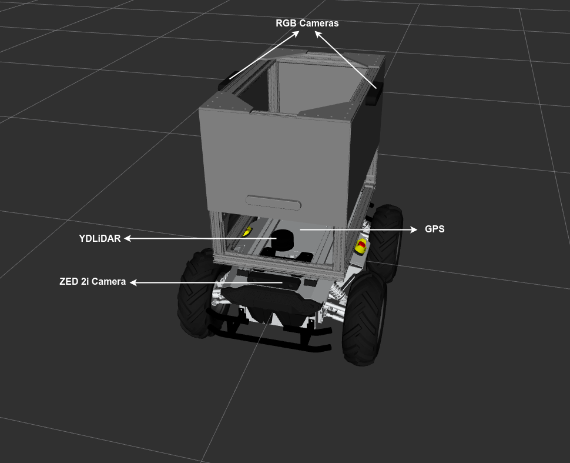

# Introduction

## Phase 1: Simulation

In this simulation-only phase, teams would work on providing solutions to two (2) fundamental tasks of a delivery robot which are: 

* Autonomous field navigation
* Weed detection

The simulation platform to be used in this phase is the [Gazebo Simulator](http://gazebosim.org/). Teams are required to develop, test and submit software to successfully complete these tasks autonomously. This phase will evaluate the teams' capabilities to successfully complete these fundamental tasks required to compete in phase 2 (on the physical robot).

Each task is designed as stand-alone, not depending on other task functionalities, hence, we request teams to complete the tasks separately. The tasks would be evaluated individually and the total team score for this phase would be the sum of individual task scores.

Teams are provided with the **PARC AgRobot**'s ROS packages and Gazebo environment models (see description below) to enable them develop and test their solutions (see [GitHub Repository](https://github.com/PARC-Robotics/PARC-Engineers-League)).

### The PARC AgRobot
The **PARC AgRobot** (Agricultural Robot) is an unmanned ground vehicle (UGV) equipped with different sensors to help you achieve your goal. The sensors are:

* **YDLiDAR:** A LiDAR sensor located at the top of the base of the robot. The YDLiDAR publishes the `/scan` topic.

* **RGB Camera (x2):** Two downward-facing RGB cameras are provided at the left and right side of the robot. These cameras are suspended via an overhang and gives top-view of the farmland. The topics published by these cameras have group names which are `/left_camera/` and `/right_camera/`.

* **ZED 2i Camera:** This is a stereo camera at the front of the robot base. It publishes all the `/zed2/` topics including imu data(`/zed2/imu/data`) and point cloud data(`/zed2/point_cloud/cloud_registered`)

* **GPS:** For localization, we provided a GPS sensor which simulates a GNSS (Global Navigation Satellite System). It publishes the `/gps/` topics.

The figure below shows the AgRobot with sensors labelled.

### Simulation Environment
The simulation environment used in this phase is modeled as a realistic farmland with rough terrain, lettuce crops, trees, barns, and pickup truck.

