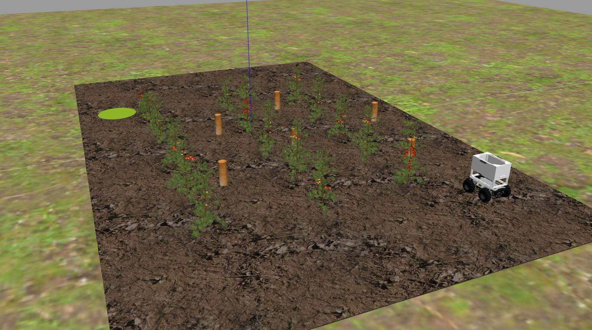
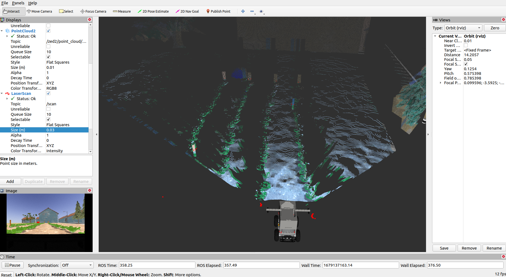
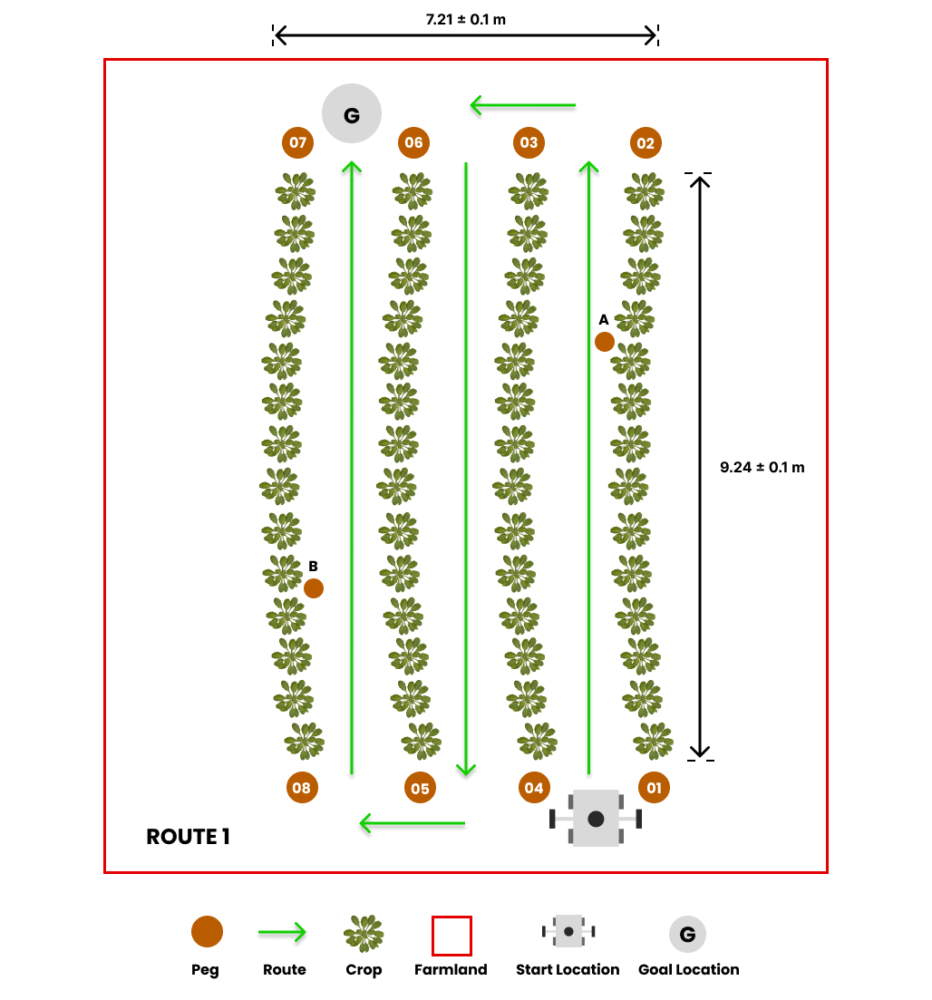
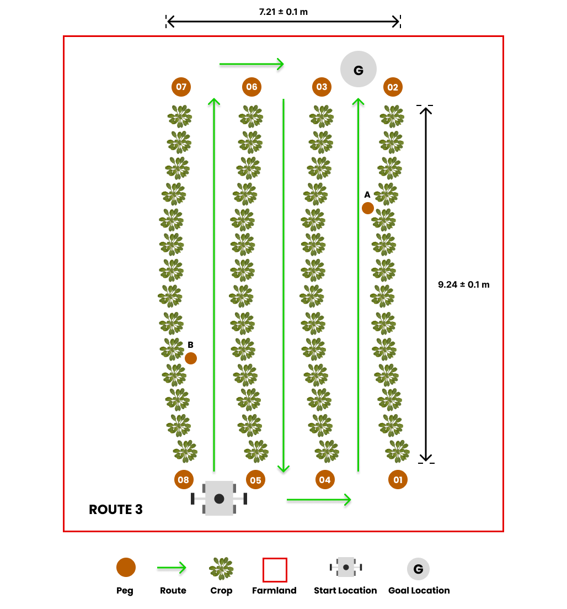

# Tâche 1 : navigation autonome sur le terrain

## Description générale


Les robots agricoles doivent être capables de naviguer dans les cultures et les terres agricoles, ce qui inclut de se déplacer de manière autonome dans les rangées de laitues sur un terrain accidenté. Cette tâche consiste à atteindre la fin d'une rangée, à effectuer un virage et à revenir dans les rangées adjacentes jusqu'à ce que l'emplacement du but soit atteint. Les équipes doivent développer un logiciel pour guider le robot à travers un [chemin prédéfini](#exploring-multiple-routes) dans les rangées de cultures, de sa position de départ à l'emplacement cible.

## Consignes de tâche
### Lancement de la tâche
Dans un nouveau terminal, exécutez le fichier de lancement suivant pour faire apparaître le robot dans Gazebo et RViz :

```sh
roslaunch parc_robot task1.launch
```

Vous devriez voir l'affichage ci-dessous dans Gazebo et RViz respectivement. A droite, il y a le robot et à gauche se trouve la sphère orange-rouge qui représente l'emplacement du but.

=== "Gazébo"
     

=== "RViz"
     

### Explorer plusieurs itinéraires
* Nous avons préparé trois itinéraires prédéfinis que vous pouvez utiliser lorsque vous développez votre solution, chaque itinéraire ayant un emplacement d'objectif différent.

=== "Itinéraire 1"
     

=== "Itinéraire 2"
     

=== "Itinéraire 3"
     


La route par défaut est `route1`, mais vous pouvez sélectionner la deuxième et la troisième option de route (`route2` et `route3`) en passant l'argument dans la commande roslaunch comme suit :

```sh
## route2
roslaunch parc_robot task1.launch route:=route2

## route3
roslaunch parc_robot task1.launch route:=route3
```

* Nous vous recommandons de jouer avec au moins ces trois itinéraires pour vous assurer que votre solution est robuste pour différents emplacements de départ.

* Pour obtenir l'emplacement cible GPS pour cette tâche, quelle que soit l'option d'itinéraire, vous pouvez utiliser un paramètre ROS. Voici un exemple de la façon d'obtenir l'emplacement du but en tant que paramètre ROS :

=== "MATLAB"
    ```matlab
    % Initialize the ROS node
    rosinit

    % Get the goal parameter
    goal = rosparam('get', 'goal_location');

    % Print the goal location
    disp(['goal location: ' num2str(goal.latitude) ' ' num2str(goal.longitude)])

    ```
=== "Python"
    ```python
    #!/usr/bin/env python

    import rospy

    rospy.init_node('goal_parameter')

    # Get goal parameter
    goal = rospy.get_param('goal_location')
    lat, lon = goal['latitude'], goal['longitude']

    # Print goal location
    rospy.loginfo("goal location: %f %f %f", lat, lon)

    ```
=== "C++"
    ```cpp
    #include <ros/ros.h>
    #include "map"

    int main(int argc, char** argv)
    {
      ros::init(argc, argv, "goal_parameter");

      // Get goal parameter
      std::map<std::string, double> goal;
      ros::param::get("goal_location", goal);

      // Print goal location
      ROS_INFO("goal location: %f %f %f", goal["latitude"], goal["longitude"]);

      return 0;
    }
    ```

De même, les coordonnées GPS des piquets sur les terres agricoles peuvent être obtenues en tant que paramètre si vous en avez besoin pour la localisation. Voici un exemple de la façon d'obtenir les coordonnées GPS de **peg 01** :

=== "MATLAB"
    ```matlab
    % Initialize the ROS node
    rosinit

    % Get the peg parameter
    peg01 = rosparam('get', 'peg_01');

    % Print the goal location
    disp(['peg01 coordinate: ' num2str(peg01.latitude) ' ' num2str(peg01.longitude)])

    ```
=== "Python"
    ```python
    #!/usr/bin/env python

    import rospy

    rospy.init_node('peg01_coordinate')

    # Get goal parameter
    peg01 = rospy.get_param('peg_01')
    lat, lon = peg01['latitude'], peg01['longitude']

    # Print goal location
    rospy.loginfo("peg01 coordinate: %f %f %f", lat, lon)

    ```
=== "C++"
    ```cpp
    #include <ros/ros.h>
    #include "map"

    int main(int argc, char** argv)
    {
      ros::init(argc, argv, "peg01_coordinate");

      // Get goal parameter
      std::map<std::string, double> peg01;
      ros::param::get("peg_01", peg01);

      // Print goal location
      ROS_INFO("peg01 coordinate: %f %f %f", peg01["latitude"], peg01["longitude"]);

      return 0;
    }
    ```

!!! avertissement
     Veuillez **NE PAS** utiliser les coordonnées cartésiennes de l'emplacement du but et des piquets fournis par Gazebo ou le fichier mondial de quelque manière que ce soit. Vous serez pénalisé si vous le faites.

### Conversion du GPS en cartésien
Notre module, **gps2cartesian**, fournit un moyen pratique de convertir les positions GPS en coordonnées cartésiennes x-y. En utilisant la coordonnée GPS de la position de départ du robot comme origine de référence (0, 0) en coordonnées cartésiennes, la fonction **gps_to_cartesian()** calcule les coordonnées cartésiennes de toute position GPS souhaitée passée en paramètre à la fonction . Voici un exemple d'utilisation du module pour obtenir la coordonnée cartésienne du robot par rapport à l'origine de référence (ou emplacement de départ) :

=== "MATLAB"
    ```matlab
    % Ce code nécessite que vous installiez la Geographiclib MATLAB Toolbox.
    % Suivez les étapes ci-dessous pour installer geographiclib sur MATLAB
    % 1. Cliquez sur l'icône Add-Ons sur MATLAB et recherchez geographiclib à l'aide de la barre de recherche.
    % 2. Choisissez le module complémentaire geographiclib et cliquez sur Add (connectez-vous si vous y êtes invité).
    % 3. Installer/Enregistrer

    rosshutdown
    rosinit

    % Attendre un message sur le sujet "gps/fix"
    gps_sub = rossubscriber('gps/fix', 'sensor_msgs/NavSatFix');
    gps = receive(gps_sub);

    % Convertir le GPS en coordonnées cartésiennes.
    [x, y] = gps_to_cartesian(gps.Latitude, gps.Longitude);

    disp(['La traduction de l'origine (0,0) à l'emplacement GPS fourni est ' num2str(x) ', ' num2str(y)])

    ```
=== "Python"
    ```python
    #!/usr/bin/env python3
    ## Installez le module geographiclib 2.0 pour que ce code fonctionne.
    ## Pour installer geographiclib 2.0, copiez la ligne ci-dessous sur votre terminal.
    ## pip install geographiclib
    ## L'une des tâches de compétition PARC doit être en cours d'exécution pour que ce code fonctionne.

    import rospy
    from sensor_msgs.msg import NavSatFix
    from parc_robot.gps2cartesian import gps_to_cartesian

    rospy.init_node('gps_goal')
    gps = rospy.wait_for_message('gps/fix', NavSatFix) # abonnez-vous une fois au sujet GPS.
    x, y = gps_to_cartesian(gps.latitude, gps.longitude) # obtenir les coordonnées cartésiennes à partir des coordonnées GPS.
    rospy.loginfo("La traduction de l'origine (0,0) à l'emplacement GPS fourni est {:.3f}, {:.3f} m.".format(x, y))

    ```
=== "C++"
    ```cpp
    /*
      Ce code utilise la librairie geographiclib. Pour installer geographiclib pour C++.
      Suivez les instructions ci-dessous :
      1. Téléchargez geographiclib via ce lien -> https://sourceforge.net/projects/geographiclib/files/distrib-C++/GeographicLib-2.2.zip
         Les étapes ci-dessous doivent être effectuées sur votre terminal.
      2. Allez à l'endroit où vous avez téléchargé le fichier -> cd ~/Downloads
      3. Décompressez le fichier -> unzip -q GeographicLib-2.2.zip
      4. Entrez dans le répertoire -> cd GeographicLib-2.2
      5. Créez un répertoire de construction séparé -> mkdir BUILD
      6. Entrez dans le répertoire de construction -> cd BUILD
      7. Exécutez cmake (ajoutez les deux points) -> cmake ..
      8. Exécutez make -> make

      /////////////////////////////////////////
      Décommentez chaque ligne après le premier find_package() dans le fichier CMakeLists.txt du package parc_robot.
      /////////////////////////////////////////
      
      Configurez CMakeLists.txt pour votre propre package ros (pas le package parc_robot) de cette façon :
      
      cmake_minimum_required(VERSION 3.0.2)
      project(my_package_name)
      
      find_package(catkin REQUIRED COMPONENTS
        roscpp
        rospy
        std_msgs
        sensor_msgs
        parc_robot # Add parc_robot package to packages ROS should find
      )
      
      catkin_package()
      
      include_directories(
        ${catkin_INCLUDE_DIRS}
        ${parc_robot_INCLUDE_DIRS}
      )
      
      ## Change my_node to whatever your node name is
      add_executable(my_node src/my_node.cpp)
      target_link_libraries(my_node 
        ${catkin_LIBRARIES}
        ${parc_robot_LIBRARIES}
      )

    */

    #include "ros/ros.h"
    #include "sensor_msgs/NavSatFix.h"
    #include "parc_robot/gps2cartesian.h" // Ajouter l'api gps2cartesian fournie par PARC

    int main(int argc, char **argv)
    {
      ros::init(argc, argv, "gps_to_cartesian");
      ros::NodeHandle nh;
      sensor_msgs::NavSatFixConstPtr msg = ros::topic::waitForMessage<sensor_msgs::NavSatFix>("gps/fix");
      std::cout << msg->latitude << std::endl;
      std::cout << msg->longitude << std::endl;
      auto position = gps_to_cartesian(msg->latitude, msg->longitude);
      ROS_INFO("La traduction de l'origine (0,0) à l'emplacement GPS fourni est: %f, %f", position.x, position.y);

      return 0;
    }
    
    ```

### Préparation de votre solution
* Votre solution doit être préparée sous forme de packages ROS à enregistrer dans votre dossier de solution. Créez un fichier de lancement dans votre package ROS qui exécute TOUT le code dont vous avez besoin dans votre solution. Nommez ce fichier de lancement : `task1_solution.launch`.

* Par conséquent, votre solution à la tâche 1 doit être exécutée en appelant les commandes suivantes :

Dans un terminal :

```sh
roslaunch parc_robot task1.launch
```

Ou

```sh
roslaunch parc_robot task1.launch route:=route2
```

Ou

```sh
roslaunch parc_robot task1.launch route:=route3
```

!!! remarque "Remarque"
     Veuillez patienter jusqu'à ce que les modèles de monde et de robot aient fini de se reproduire. Ce processus peut prendre plus de temps que d'habitude, en particulier lors de la première exécution du programme.

Dans un autre terminal :

```sh
roslaunch <nom-de-votre-paquet> task1_solution.launch
```

## Règles de tâche

* Le temps limite pour terminer la tâche est de **4 minutes (240 secondes)**.

* La tâche est UNIQUEMENT terminée lorsque N'IMPORTE QUELLE partie du robot se trouve à l'intérieur de la sphère orange-rouge (marqueur d'emplacement d'objectif) après avoir suivi le chemin prédéfini comme indiqué ci-dessus.

!!! remarque "Remarque"
     Assurez-vous de NE PAS fournir de solution avec des positions codées en dur vers lesquelles le robot doit se déplacer, car lors de l'évaluation, la position initiale du robot serait aléatoire.

La notation de cette tâche serait basée sur les critères suivants :

| S/N | Critère/Métrique | Descriptif |
| ----------- | ----------- | ------- |
| 1 | **Chemin prédéfini** | Chaque route lancée a un chemin prédéfini qui **doit** être suivi comme expliqué dans [Description de la route](#exploring-multiple-routes). |
| 2 | **Évitement des cultures** | Le robot doit éviter de passer ou d'avoir un contact avec les cultures. **(Moins de contact, c'est mieux)** |
| 3 | **Distance finale parcourue jusqu'au but** | Distance de déplacement la plus courte du robot (mesurée à partir du centre du robot) à travers les rangées de cultures jusqu'à l'objectif, calculée à la limite de temps [4 minutes] **(Plus petit est préférable)**
| 4 | **Délai de réalisation** | Délai entre le lancement de la solution et l'achèvement de la tâche **(Plus petit est préférable)** |