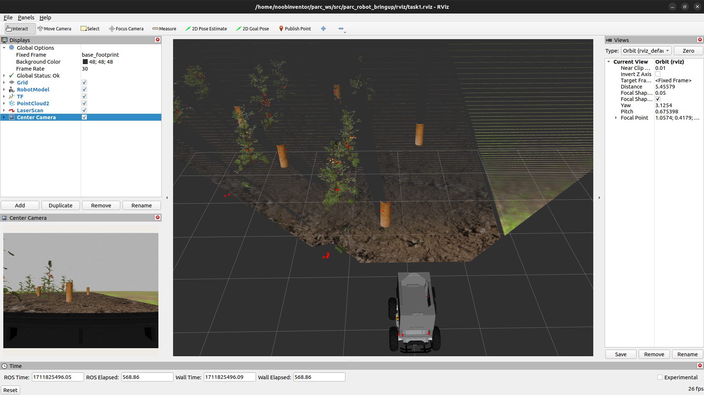
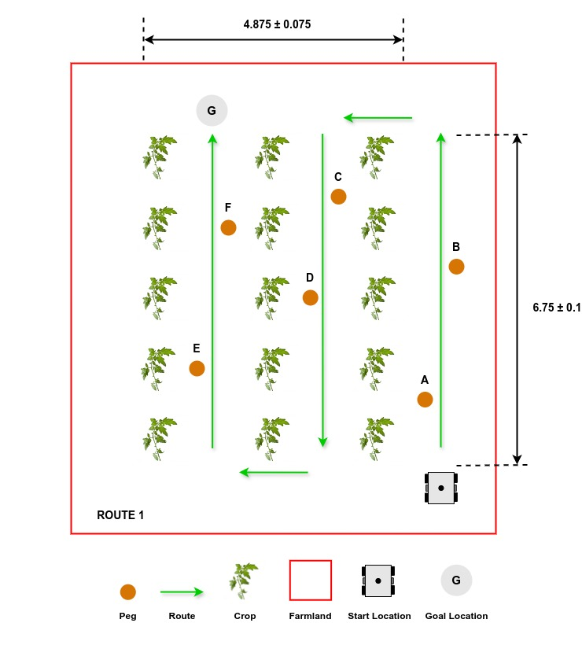
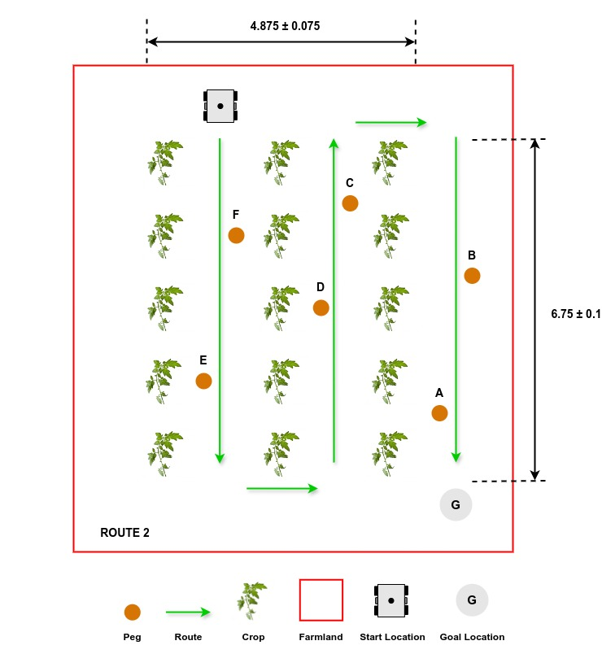
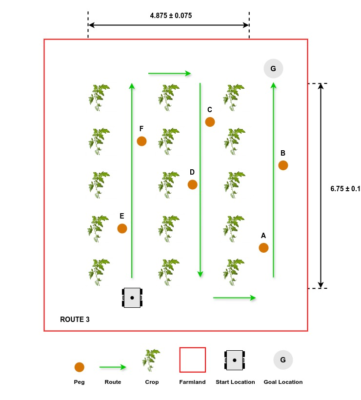

# Task 1: Autonomous Field Navigation

## General Description


Agricultural robots must be able to navigate through crops and farmland, which includes autonomously moving through rows of tomato plants on rough terrain. This task involves reaching the end of a row, making a turn, and returning in adjacent rows until the goal location is reached. Teams must develop software to guide the robot through a [pre-defined path](#exploring-multiple-routes) within the crop rows, from its starting position to the goal location.

## Task Guidelines
### Launching the Task
In a new terminal, run the following launch file to bring up the robot in Gazebo and RViz:

```sh
ros2 launch parc_robot_bringup task1_launch.py
```

You should see the display below in Gazebo and RViz respectively. To the right, there's the robot and to the left is the green circle which represents the goal location.

=== "Gazebo"
    

=== "RViz"
    

### Exploring Multiple Routes
* We have prepared three pre-defined routes you can use as you develop your solution with each route having different goal location.

=== "Route 1"
    

=== "Route 2"
    

=== "Route 3"
    


The default route is `route1`, but you can select the second and third route option (`route2` and `route3`) by passing the argument in the `ros2 launch` command as follows:

```sh
## route2
ros2 launch parc_robot_bringup task1_launch.py route:=route2

## route3
ros2 launch parc_robot_bringup task1_launch.py route:=route3
```

* We recommend you play around with at least these three routes to ensure your solution is robust to different start locations.

* To obtain the GPS goal location for this task, regardless of the route option, you can use a ROS parameter. Here is an example of how to obtain the goal location as a ROS parameter:

```python
#!/usr/bin/env python3

import rclpy
from rclpy.node import Node


class GoalLocation(Node):
    def __init__(self):
        super().__init__("goal_location")

        # Declare goal latitude and longitude parameters
        self.declare_parameter("goal_latitude", rclpy.Parameter.Type.DOUBLE)
        self.declare_parameter("goal_longitude", rclpy.Parameter.Type.DOUBLE)

        # Get goal location from world coordinates yaml file
        goal_lat = self.get_parameter("goal_latitude")
        goal_long = self.get_parameter("goal_longitude")

        # Print goal location
        self.get_logger().info(
            "goal location: %f %f"
            % (
                goal_lat.value,
                goal_long.value,
            )
        )


def main(args=None):
    rclpy.init(args=args)

    goal_location = GoalLocation()
    rclpy.spin(goal_location)

    goal_location.destroy_node()
    rclpy.shutdown()


if __name__ == "__main__":
    main()
```

Similarly, the GPS coordinates of the pegs on the farmland can be obtained as a parameter if you need it for localization. Here is an example of how to obtain the GPS coordinate of **peg A**:

```python
#!/usr/bin/env python3

import rclpy
from rclpy.node import Node


class PegALocation(Node):
    def __init__(self):
        super().__init__("peg_a_coordinates")

        # Declare peg A latitude and longitude parameters
        self.declare_parameter("peg_a_latitude", rclpy.Parameter.Type.DOUBLE)
        self.declare_parameter("peg_a_longitude", rclpy.Parameter.Type.DOUBLE)

        # Get peg A location from world coordinates yaml file
        peg_a_lat = self.get_parameter("peg_a_latitude")
        peg_a_long = self.get_parameter("peg_a_longitude")

        # Print peg A location
        self.get_logger().info(
            "Peg A location: %f %f"
            % (
                peg_a_lat.value,
                peg_a_long.value,
            )
        )


def main(args=None):
    rclpy.init(args=args)
    
    peg_a_coordinates = PegALocation()
    rclpy.spin(peg_a_coordinates)

    peg_a_coordinates.destroy_node()
    rclpy.shutdown()


if __name__ == "__main__":
    main()
```

!!! warning
    Please **DO NOT** use the cartesian coordinates of the goal location and pegs provided by Gazebo or the world file in any way. You will be penalized if you do.

### Converting GPS to Cartesian
Our module, **gps2cartesian**, provides a convenient way to convert GPS locations to x-y Cartesian coordinates. By using the Gazebo world origin as the GPS reference origin (0, 0) in Cartesian coordinates, the **gps_to_cartesian()** function calculates the Cartesian coordinates of any desired GPS location passed as a parameter to the function. Here is an example of how to use the module to get the cartesian coordinate of the robot with respect to the reference origin:

```python
#!/usr/bin/env python3
## Install the geographiclib 2.0 module for this code to work.
## To install geographiclib 2.0, copy the line below to your terminal.
## pip install geographiclib
## Any of the PARC competition task must be running for this code to work.

import rclpy
from rclpy.node import Node
from sensor_msgs.msg import NavSatFix
from parc_robot_bringup.gps2cartesian import gps_to_cartesian


class GPSGoal(Node):
    def __init__(self):
        super().__init__("gps_goal")

        # Subscribe to the gps topic once
        self.gps_sub = self.create_subscription(
            NavSatFix, "/gps/fix", self.gps_callback, 1
        )

    def gps_callback(self, gps):

        # Get the cartesian coordinates from the GPS coordinates
        x, y = gps_to_cartesian(gps.latitude, gps.longitude)

        # Print cartesian coordinates
        self.get_logger().info(
            "The translation from the origin (0, 0) to the gps location provided: %.3f %.3f"
            % (x, y)
        )


def main(args=None):
    rclpy.init(args=args)

    gps_goal = GPSGoal()
    rclpy.spin(gps_goal)

    gps_goal.destroy_node()
    rclpy.shutdown()


if __name__ == "__main__":
    main()
```

### Preparing your Solution
* Your solution should be prepared as ROS packages to be saved in your solution folder. Create a launch file in your ROS package which runs ALL the code you need in your solution. Name this launch file: `task1_solution.launch`.

* Hence, your solution to Task 1 should be run by calling the following commands:

In one terminal:

```sh
ros2 launch parc_robot_bringup task1_launch.py
```

Or 

```sh
ros2 launch parc_robot_bringup task1_launch.py route:=route2
```

Or

```sh
ros2 launch parc_robot_bringup task1_launch.py route:=route3
```

!!! note "Note"
    Please wait until both the world and robot models have finished spawning. This process may take longer than usual, especially when running the program for the first time.

In another terminal:

```sh
ros2 launch <your-package-name> task1_solution_launch.py
```

Mindful of your workspace name in the path below
```
ros2 run <your-package-name> <your_node> --ros-args --params-file ~/parc_ws/src/parc_robot_bringup/config/route1_world_coordinates.yaml
```

## Task Rules

* The time limit to complete the task is **6 minutes (360 seconds)**.

* The task is ONLY complete when ANY part of the robot is inside the orange-red sphere (goal location marker) after following the pre-defined path as shown above.

!!! note "Note"
    Ensure you DO NOT provide a solution with hard-coded positions for the robot to move to because in evaluation, the robot initial position would be randomized. 

Scoring for this task would be based on the following criteria:

| S/N      | Criteria/Metric | Description |
| ----------- | ----------- | ------- |
| 1  | **Pre-defined path** | Every route launched has a pre-defined path that **must** be followed as explained at [Route Description](#exploring-multiple-routes). |
| 2  | **Crop avoidance**  | The robot should avoid going over or having contact with the crops. **(Less contact is better)** |
| 3 | **Final travel distance to goal** | Shortest travel distance from robot (measured from robot center) through the crop rows to the goal which is calculated at the time limit [6 minutes] **(Smaller is better)**
| 4  | **Completion time** | Time from launching the solution to task completion **(Smaller is better)** |
