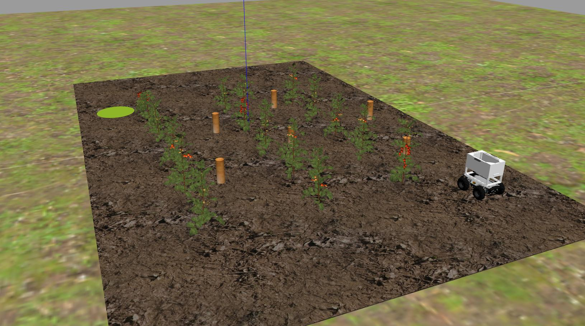

# Task 1: Autonomous Field Navigation

## General Description


Agricultural robots must be able to navigate through crops and farmland, which includes autonomously moving through lettuce crop rows on rough terrain. This task involves reaching the end of a row, making a turn, and returning in adjacent rows until the goal location is reached. Teams must develop software to guide the robot through a [pre-defined path](#exploring-multiple-routes) within the crop rows, from its starting position to the goal location.

## Task Guidelines
### Launching the Task
In a new terminal, run the following launch file to bring up the robot in Gazebo and RViz:

```sh
roslaunch parc_robot task1.launch
```

You should see the display below in Gazebo and RViz respectively. To the right, there's the robot and to the left is the orange-red sphere which represents the goal location.

=== "Gazebo"
    

=== "RViz"
    

### Exploring Multiple Routes
* We have prepared three pre-defined routes you can use as you develop your solution with each route having different goal location.

=== "Route 1"
    

=== "Route 2"
    

=== "Route 3"
    


The default route is `route1`, but you can select the second and third route option (`route2` and `route3`) by passing the argument in the roslaunch command as follows:

```sh
## route2
roslaunch parc_robot task1.launch route:=route2

## route3
roslaunch parc_robot task1.launch route:=route3
```

* We recommend you play around with at least these three routes to ensure your solution is robust to different start locations.

* To obtain the GPS goal location for this task, regardless of the route option, you can use a ROS parameter. Here is an example of how to obtain the goal location as a ROS parameter:

=== "MATLAB"
    ```matlab
    % Initialize the ROS node
    rosinit

    % Get the goal parameter
    goal_longitude = rosparam('get', 'goal_longitude');
    goal_latitude = rosparam('get', 'goal_latitude');

    % Print the goal location
    disp(['goal location: ' num2str(goal_latitude) ' ' num2str(goal_longitude)])

    ```
=== "Python"
    ```python
    #!/usr/bin/env python3

    import rospy

    rospy.init_node('goal_parameter')

    # Get goal parameter
    lat, lon = rospy.get_param('goal_latitude'), rospy.get_param('goal_longitude')

    # Print goal location
    rospy.loginfo("goal location: %f %f", lat, lon)

    ```
=== "C++"
    ```cpp
    // You have to configure the CMakeLists.txt for this C++ code to work.
    // Visit http://wiki.ros.org/ROS/Tutorials/WritingPublisherSubscriber%28c%2B%2B%29 and check section 3. Building your nodes to learn how to set up CMakeLists.txt

    #include <ros/ros.h>
    #include "map"

    int main(int argc, char** argv)
    {
      ros::init(argc, argv, "goal_parameter");

      double latitude, longitude;
      ros::param::get("goal_longitude", longitude);
      ros::param::get("goal_latitude", latitude);

      // Print goal location
      ROS_INFO("goal location: %f %f", latitude, longitude);

      return 0;
    }
    ```

Similarly, the GPS coordinates of the pegs on the farmland can be obtained as a parameter if you need it for localization. Here is an example of how to obtain the GPS coordinate of **peg 01**:

=== "MATLAB"
    ```matlab
    % Initialize the ROS node
    rosinit

    % Get the peg parameter
    peg01 = rosparam('get', 'peg_01');

    % Print the goal location
    disp(['peg01 coordinate: ' num2str(peg01.latitude) ' ' num2str(peg01.longitude)])

    ```
=== "Python"
    ```python
    #!/usr/bin/env python3

    import rospy

    rospy.init_node('peg01_coordinate')

    # Get goal parameter
    peg01 = rospy.get_param('peg_01')
    lat, lon = peg01['latitude'], peg01['longitude']

    # Print goal location
    rospy.loginfo("peg01 coordinate: %f %f", lat, lon)

    ```
=== "C++"
    ```cpp
    // You have to configure the CMakeLists.txt for this C++ code to work.
    // Visit http://wiki.ros.org/ROS/Tutorials/WritingPublisherSubscriber%28c%2B%2B%29 and check section 3. Building your nodes to learn how to set up CMakeLists.txt
    
    #include <ros/ros.h>
    #include "map"

    int main(int argc, char **argv)
    {
      ros::init(argc, argv, "peg01_coordinate");

      // Get goal parameter
      std::map<std::string, double> peg01;
      ros::param::get("peg_01", peg01);

      // Print goal location
      ROS_INFO("peg01 coordinate: %f %f", peg01["latitude"], peg01["longitude"]);

      return 0;
    }
    ```

!!! warning
    Please **DO NOT** use the cartesian coordinates of the goal location and pegs provided by Gazebo or the world file in any way. You will be penalized if you do.

### Converting GPS to Cartesian
Our module, **gps2cartesian**, provides a convenient way to convert GPS locations to x-y Cartesian coordinates. By using the Gazebo world origin as the GPS reference origin (0, 0) in Cartesian coordinates, the **gps_to_cartesian()** function calculates the Cartesian coordinates of any desired GPS location passed as a parameter to the function. Here is an example of how to use the module to get the cartesian coordinate of the robot with respect to the reference origin:

=== "MATLAB"
    ```matlab
    % This code requires that you install the geographiclib MATLAB Toolbox.
    % Follow the steps below to install geographiclib on MATLAB
    % 1. Click on the Add-Ons icon on MATLAB and search for geographiclib using the search bar.
    % 2. Choose the geographiclib Add-On and click Add (Sign-in if you're prompted to).
    % 3. Install/Save

    rosshutdown
    rosinit

    % Wait for a message on the "gps/fix" topic
    gps_sub = rossubscriber('gps/fix', 'sensor_msgs/NavSatFix');
    gps = receive(gps_sub);

    % Convert GPS to cartesian coordinate.
    [x, y] = gps_to_cartesian(gps.Latitude, gps.Longitude);

    disp(['The translation from the origin (0,0) to the gps location provided is ' num2str(x) ', ' num2str(y)])

    ```
=== "Python"
    ```python
    #!/usr/bin/env python3
    ## Install the geographiclib 2.0 module for this code to work.
    ## To install geographiclib 2.0, copy the line below to your terminal.
    ## pip install geographiclib
    ## Any of the PARC competition task must be running for this code to work.

    import rospy
    from sensor_msgs.msg import NavSatFix
    from parc_robot.gps2cartesian import gps_to_cartesian

    rospy.init_node('gps_goal')
    gps = rospy.wait_for_message('gps/fix', NavSatFix) # subscribe to the gps topic once.
    x, y = gps_to_cartesian(gps.latitude, gps.longitude) # get the cartesian coordinates from the GPS coordinates.
    rospy.loginfo("The translation from the origin (0,0) to the gps location provided is {:.3f}, {:.3f} m.".format(x, y))

    ```
=== "C++"
    ```cpp
    /*
      This code uses the geographiclib library. To install geographiclib for C++.
      Follow the instructions below:
      1. Download geographiclib via this link -> https://sourceforge.net/projects/geographiclib/files/distrib-C++/GeographicLib-2.2.zip
         The steps below should be done on your terminal.
      2. Go to where you downloaded the file -> cd ~/Downloads
      3. Unzip the file -> unzip -q GeographicLib-2.2.zip
      4. Enter the directory -> cd GeographicLib-2.2
      5. Create a separate build directory -> mkdir BUILD
      6. Enter the build directory -> cd BUILD
      7. Run cmake (add the two dots) -> cmake ..
      8. Run make -> make

      /////////////////////////////////////////
      Uncomment every line after the first find_package() in the CMakeLists.txt of the parc_robot package.
      /////////////////////////////////////////
      
      Configure CMakeLists.txt for your own ros package (not parc_robot package) this way:
      
      cmake_minimum_required(VERSION 3.0.2)
      project(my_package_name)
      
      find_package(catkin REQUIRED COMPONENTS
        roscpp
        rospy
        std_msgs
        sensor_msgs
        parc_robot # Add parc_robot package to packages ROS should find
      )
      
      catkin_package()
      
      include_directories(
        ${catkin_INCLUDE_DIRS}
        ${parc_robot_INCLUDE_DIRS}
      )
      
      ## Change my_node to whatever your node name is
      add_executable(my_node src/my_node.cpp)
      target_link_libraries(my_node 
        ${catkin_LIBRARIES}
        ${parc_robot_LIBRARIES}
      )

    */

    #include "ros/ros.h"
    #include "sensor_msgs/NavSatFix.h"
    #include "parc_robot/gps2cartesian.h" // Add the gps2cartesian api provided by PARC

    int main(int argc, char **argv)
    {
      ros::init(argc, argv, "gps_to_cartesian");
      ros::NodeHandle nh;
      sensor_msgs::NavSatFixConstPtr msg = ros::topic::waitForMessage<sensor_msgs::NavSatFix>("gps/fix");
      std::cout << msg->latitude << std::endl;
      std::cout << msg->longitude << std::endl;
      auto position = gps_to_cartesian(msg->latitude, msg->longitude);
      ROS_INFO("The translation from the origin (0,0) to the gps location provided is: %f, %f", position.x, position.y);

      return 0;
    }
    
    ```

### Preparing your Solution
* Your solution should be prepared as ROS packages to be saved in your solution folder. Create a launch file in your ROS package which runs ALL the code you need in your solution. Name this launch file: `task1_solution.launch`.

* Hence, your solution to Task 1 should be run by calling the following commands:

In one terminal:

```sh
roslaunch parc_robot task1.launch
```

Or 

```sh
roslaunch parc_robot task1.launch route:=route2
```

Or

```sh
roslaunch parc_robot task1.launch route:=route3
```

!!! note "Note"
    Please wait until both the world and robot models have finished spawning. This process may take longer than usual, especially when running the program for the first time.

In another terminal:

```sh
roslaunch <your-package-name> task1_solution.launch
```

## Task Rules

* The time limit to complete the task is **6 minutes (360 seconds)**.

* The task is ONLY complete when ANY part of the robot is inside the orange-red sphere (goal location marker) after following the pre-defined path as shown above.

!!! note "Note"
    Ensure you DO NOT provide a solution with hard-coded positions for the robot to move to because in evaluation, the robot initial position would be randomized. 

Scoring for this task would be based on the following criteria:

| S/N      | Criteria/Metric | Description |
| ----------- | ----------- | ------- |
| 1  | **Pre-defined path** | Every route launched has a pre-defined path that **must** be followed as explained at [Route Description](#exploring-multiple-routes). |
| 2  | **Crop avoidance**  | The robot should avoid going over or having contact with the crops. **(Less contact is better)** |
| 3 | **Final travel distance to goal** | Shortest travel distance from robot (measured from robot center) through the crop rows to the goal which is calculated at the time limit [6 minutes] **(Smaller is better)**
| 4  | **Completion time** | Time from launching the solution to task completion **(Smaller is better)** |
