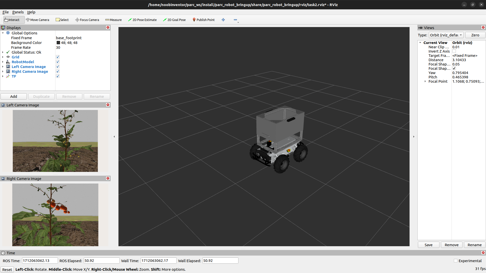

# Task 2: Crop Yield Estimation


## General Description

According to the United Nations, the world population is predicted to rise to 8.5 billion by 2030, with Africa being the fastest growing continent. This projected population growth necessitates the urgency for food security. Accurately estimating crop yields are an essential facet in the pursuit for food security
and autonomous agricultural robots are employed in this undertaking.

For this task, the PARC robot is autonomously driven through two rows of tomato plants and teams are to develop software to estimate the yield of the tomato field by making use of the robot's RGB cameras and computer vision.

## Task Guidelines

### Launching the Task

In a new terminal, run the following launch file to bring up the robot in Gazebo and RViz:

```bash
ros2 launch parc_robot_bringup task2_launch.py
```

You should see the display below in Gazebo and RViz respectively.

=== "Gazebo"
    

=== "RViz"
    

There are three worlds for this task, with each world varying in the number of fruit producing tomato plants. The default world is `world1` and similar to task 1, the second and third world options, `world2` and `world3`, can be selected by passing the argument in the `ros2 launch` command below:

```bash
## world2
ros2 launch parc_robot_bringup task2_launch.py world:=world2

## world3
ros2 launch parc_robot_bringup task2_launch.py world:=world3
```

The robot starts moving once the nodes called by the launch file have been successfully loaded.

To publish the number of fruits in a chosen world, you should use the topic `/parc_robot/crop_yield` that has uses the custom message `parc_robot_interfaces/msg/CropYield` from the 
`parc_robot_interfaces` package. 

The code snippet below shows how a simple publisher to the topic and custom message is created and used: 

```python
#!/usr/bin/env python3

import rclpy
from rclpy.node import Node
from parc_robot_interfaces.msg import CropYield


class YieldTest(Node):
    def __init__(self):
        super().__init__("yield_test")
        self.yield_pub = self.create_publisher(CropYield, "/parc_robot/crop_yield", 1)
        timer_period = 0.5  # seconds
        self.timer = self.create_timer(timer_period, self.timer_callback)
        self.i = 1

    def timer_callback(self):
        msg = CropYield()

        # Assign counter variable i to crop yield message data
        msg.data = self.i

        # Publish message
        self.yield_pub.publish(msg)

        # Log information to the console
        self.get_logger().info("Current crop yield is: %d" % msg.data)

        # Increment counter variable
        self.i += 1


def main(args=None):
    rclpy.init(args=args)

    yield_test = YieldTest()
    rclpy.spin(yield_test)

    yield_test.destroy_node()
    rclpy.shutdown()


if __name__ == "__main__":
    main()
```

This line imports the message in the node:

```python
from parc_robot_interfaces.msg import CropYield
```

A new topic called `/parc_robot/robot_status` has been added to publish the current status of the robot. The message type for this topic is `std_msgs/String`, which indicates whether the robot has started moving along the route or has finished the designated route. The robot status has two possible values: **"started"** and **"finished"**.

We recommend you play around with the different tomato field worlds to ensure your solution is robust to different worlds.

### Install OpenCV

For the task, it is recommended to use [OpenCV](https://opencv.org/){target=_blank} for computer vision. This package can be installed on by executing this command in a terminal window:

```bash
sudo apt install python3-opencv
```

### Moving at different speeds

The robot can move at different speeds. The default speed is `0.1 m/s`, but you can change the speed by passing the argument in the `ros2 launch` command as follows:

```bash
## 0.25 m/s
ros2 launch parc_robot_bringup task2_launch.py speed:=0.25
```

Likewise, we recommend you play around with this range of speeds: `[0.25, 0.5, 0.75, 1.0]`, to ensure your solution is robust to different speeds.

### Task Expectations

The objective of the task is to count the number of red tomato fruits as the robot moves between the two rows of tomato plants. When the robot reaches the end of the row, it will come to a stop, and you should publish the total number of red tomato fruits to the `/parc_robot/crop_yield` topic.

It's important to note that real-time publication of counted tomato fruits is not necessary. You can publish the number of tomato fruits after the robot has stopped moving, which you can monitor through the `/parc_robot/robot_status` topic.

### Preparing your Solution

* Your solution should be prepared as ROS packages to be saved in your solution folder. Create a node executable file in your ROS package which runs ALL the code you need in your solution. Name this node file: `task2_solution.py`.

* In order to use the `CropYield` custom message in your solution, the `parc_robot_interfaces` dependency is added in the `package.xml` file of your solution package:

    ```xml
    <depend>parc_robot_interfaces</depend>
    ``` 

* Hence, your solution to Task 2 should be run by calling the following commands:

    In one terminal:

    ```sh
    ros2 launch parc_robot_bringup task2_launch.py
    ```

    Or 

    ```sh
    ros2 launch parc_robot_bringup task2_launch.py world:=world2
    ```

    Or

    ```sh
    ros2 launch parc_robot_bringup task2_launch.py world:=world3
    ```

    !!! note "Note"
        Please wait until both the world and robot models have finished spawning. This process may take longer than usual, especially when running the program for the first time.

    In another terminal:

    ```sh
    ros2 run <your-package-name> task2_solution.py 
    ```

## Task Rules

* Be sure to publish just ONCE to the `/parc_robot/crop_yield` topic, AND at the END of the run. The run ends when the robot sends `finished` on the `/parc_robot/robot_status` topic.
* You are not allowed to publish to the `/robot_base_controller/cmd_vel_unstamped` topic. The robot will be driven through the field by the Gazebo simulation. You are only allowed to publish to the `/parc_robot/crop_yield` topic.
* You should publish the number of tomato fruits in the field to the `/parc_robot/crop_yield` topic not more than 5 seconds after the robot has stopped moving.

## Task Evaluation

Your solution will be tested against three new tomato field worlds and at varied speeds. A total score for this task will be calculated using the formula below:


```python
total_score = W1*accuracy(speed_1) + ... + Wn*accuracy(speed_n)

```
where, 

***speed_n*** - is how fast the robot is moving in `m/s`

***accuracy*** - is calculated as the average percentage error of the 3 worlds at a particular speed
     
***Wn*** - is the weight on the accuracy term which varies with speed

Considering `world1` for instance,

```
Actual number of red tomatoes = 60
Predicted number of red tomatoes = 54
Absolute error = |60 - 54| = 6
Percentage error = (Absolute error / Actual number of red tomatoes) * 100
Percentage error = 10%
```

The average percentage error is the percentage error across the 3 worlds.
