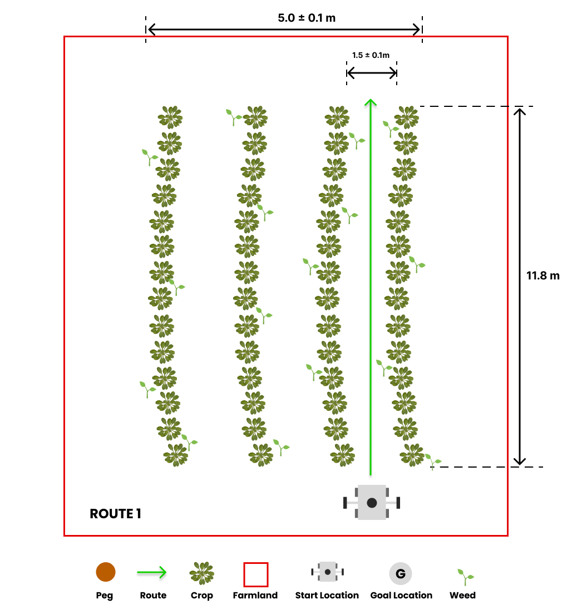
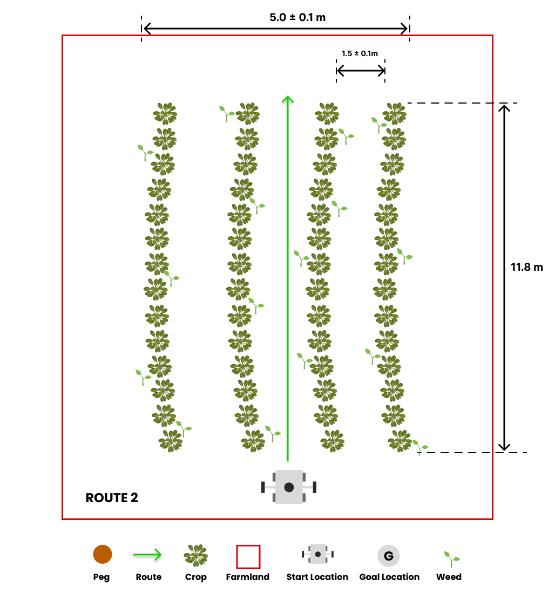
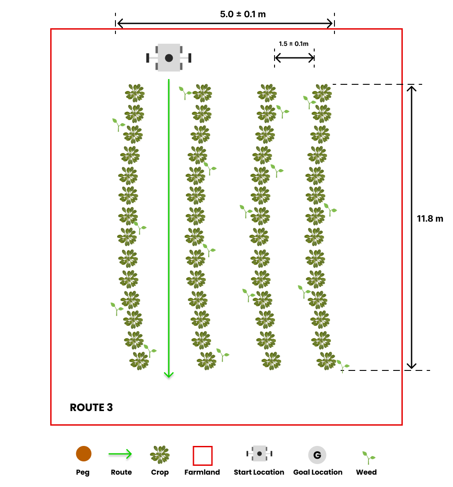

# Tâche 2: détection des mauvaises herbes


## Description générale

Les robots agricoles jouent un rôle crucial dans la détection des mauvaises herbes dans les champs, car ils peuvent entraver la croissance des cultures en concurrençant des ressources essentielles telles que l'eau, la lumière du soleil et les nutriments, et servir également de terrain de reproduction pour les ravageurs et les maladies. Le robot naviguera à travers des rangées de cultures, et l'objectif est d'identifier et de communiquer l'emplacement des mauvaises herbes présentes sur le terrain.

Vous devez effectuer cette tâche à l'aide de MATLAB. Vous pouvez trouver des instructions sur la façon d'installer MATLAB sur votre ordinateur [ici](https://www.mathworks.com/help/install/ug/install-matlab.html).

## Lignes directrices de tâche

### Lancement de la tâche

Dans un nouveau terminal, exécutez le fichier de lancement suivant pour afficher le robot dans Gazebo et Rviz:

```bash
roslaunch parc_robot parc_task2.launch
```

Lors de la sélection de l'itinéraire, le robot commencera rapidement le mouvement. Notamment, le robot est équipé d'une caméra, qui sert à détecter les mauvaises herbes sur le terrain.

Un sujet supplémentaire a été créé sous le nom `/parc_robot/weed_detection`, responsable de la publication de l'emplacement des mauvaises herbes sur le terrain. Le type de message pour ce sujet est `/parc_robot/WeedDetection`. Dans le message de latection des mauvaises herbes, une liste de messages de mauvaises herbes peut être trouvée, chacune contenant les coordonnées GPS de l'herbe sur le terrain. Le message des mauvaises herbes comprend également un champ de confiance, indiquant le niveau de certitude que le robot a que l'herbe est en effet une mauvaise herbe. Ce champ varie de 0 à 1, avec une valeur de 1 indiquant une confiance absolue et une valeur de 0 dénotant une incertitude absolue.

En outre, un nouveau sujet a été introduit comme `/parc/robot_status`, qui sert à publier le statut du robot. Le type de message pour ce sujet est `parc_robot/robotstatus`. Le message Robotstatus contient un champ d'état, représenté comme une chaîne qui informe de l'état actuel du robot. Les valeurs possibles pour ce champ sont `started` et `finished`, où `started` indique que le robot a commencé à se déplacer le long de l'itinéraire, et `finished` indique qu'il a achevé l'itinéraire désigné.

### Explorer plusieurs itinéraires

Nous avons préparé trois itinéraires prédéfinis que vous pouvez utiliser lorsque vous développez votre solution avec chaque itinéraire ayant un emplacement de départ différent.

=== "Route 1"
    

=== "Route 2"
    

=== "Route 3"
    


L'itinéraire par défaut est `route1`, mais vous pouvez sélectionner l'option de deuxième et troisième route (`route2` et `route3`) en passant l'argument dans la commande Roslaunch comme suit:

```bash
## route2
roslaunch parc_robot parc_task2.launch route:=route2

## route3
roslaunch parc_robot parc_task2.launch route:=route3
```

Nous vous recommandons de jouer avec au moins ces trois itinéraires pour vous assurer que votre solution est robuste aux différents emplacements de démarrage.

### Se déplaçant à différentes vitesses

Le robot peut se déplacer à différentes vitesses. La vitesse par défaut est de 0,1 m / s, mais vous pouvez modifier la vitesse en passant l'argument dans la commande Roslaunch comme suit:

```bash
## 0.1 m/s
roslaunch parc_robot parc_task2.launch

## 0.5 m/s
roslaunch parc_robot parc_task2.launch speed:=0.5

## 1.0 m/s
roslaunch parc_robot parc_task2.launch speed:=1.0
```

Nous vous recommandons de jouer avec différentes vitesses pour vous assurer que votre solution est robuste à différentes vitesses.

### Attentes des tâches

La tâche à accomplir consiste à conduire le robot à travers une rangée de cultures dans le but d'identifier et de communiquer l'emplacement des mauvaises herbes présentes sur le terrain. Une fois que le robot atteint la fin de la rangée, il s'arrêtera. À ce stade, vous devez publier les emplacements des mauvaises herbes au sujet `/parc_robot/weed_detection`.

Il convient de noter que la publication en temps réel des emplacements des mauvaises herbes n'est pas requise. Vous pouvez publier les emplacements des mauvaises herbes sur le terrain après que le robot a cessé de bouger. Vous pouvez déterminer quand le robot a cessé de bouger en surveillant le sujet `/parc_robot/robot_status`.

En détectant que le robot a cessé de bouger, il est alors nécessaire de publier les emplacements des mauvaises herbes au sujet `/parc_robot/weed_detection`. Dans le message Weeddection, vous pouvez trouver une liste de messages de mauvaises herbes, chaque message contenant les coordonnées GPS de l'herbe dans le domaine. De plus, le message des mauvaises herbes comprend un champ de confiance, indiquant le niveau de certitude du robot que l'herbe identifiée est en effet une mauvaise herbe. La valeur de confiance varie de 0 à 1, où une valeur de 1 indique une confiance absolue, et une valeur de 0 indique une incertitude absolue.

### Préparer votre soumission

Votre solution doit être préparée en tant que packages ROS à enregistrer dans votre dossier de solution. Créez un fichier de lancement dans votre package ROS qui exécute tout le code dont vous avez besoin dans votre solution. Nommez ce fichier de lancement: task2_solution.launch.

Par conséquent, votre solution à la tâche 2 doit être exécutée en appelant les commandes suivantes:

```bash
roslaunch <your_solution_package> task2_solution.launch
```

## Règles de tâche

* Vous n'êtes pas autorisé à publier sur le sujet `/cmd_vel`. Le robot sera conduit sur le terrain par la simulation. Vous n'êtes autorisé à publier que sur le sujet `/parc_robot/ weed_dection`.
* Vous devriez publier les emplacements des mauvaises herbes sur le terrain au sujet `/parc_robot/weed_detection` pas plus de 5 secondes après que le robot a cessé de bouger.

## Évaluation des tâches

Votre solution sera évaluée en fonction des critères suivants:

| S/N      | Criteria/Metric | Description |
| ----------- | ----------- | ------- |
| 1      | Précision       | La précision est basée sur le nombre de mauvaises herbes correctement détectées, à moins de 0,1 m de leur emplacement réel. Des détections incorrectes ou des mauvaises herbes manquées réduisent la précision. Détections multiples à moins de 0,1 m du même comptage réel de localisation qu'une détection précise. |
| 2   | Robustesse        | Nous mesurons la robustesse de votre solution en évaluant sa précision sur divers itinéraires et vitesses. La précision reçoit un poids et en moyenne sur différentes vitesses et les trois itinéraires pour déterminer la robustesse globale de votre solution. |
| 3   | Précision        | La précision est évaluée en fonction du nombre de mauvaises herbes détectées à moins de 0,1 m de leur emplacement réel par votre solution. Les faux négatifs entraînent des sanctions plus élevées dans cette évaluation, indiquant que les mauvaises herbes manquantes sont considérées comme plus préjudiciables que la détection des mauvaises herbes qui ne sont pas réellement présentes. |
