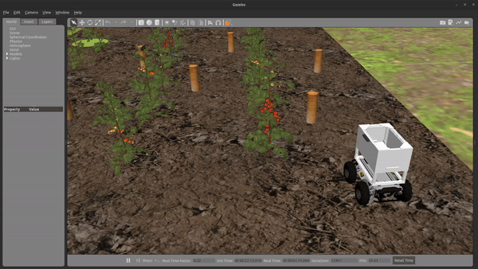

# Getting started with ROS


The [Robot Operating System](https://www.ros.org/about-ros/) (ROS) is a flexible framework for writing robot software. It is a collection of tools, libraries, and conventions that aim to simplify the task of creating complex and robust robot behavior across a wide variety of robotic platforms.

We have planned this competition around ROS because of its features as well as its widespread use in robotics research and industry.


To get started with ROS (if you are a beginner), we recommend you follow the "Beginner Level" tutorials in the official [ROS Tutorials](http://wiki.ros.org/ROS/Tutorials). Ensure you complete at least the following:


## ROS OnRamp!

Whether you are a beginner or a more advanced ROS developer, we recommend you take some time to review the following ROS tutorials.

* [ROS Official Tutorials](http://wiki.ros.org/ROS/Tutorials){target=_blank} - Ensure you complete at least chapters 5, 6, and 12.
* [ROS Tutorial Youtube Playlist](https://www.youtube.com/playlist?list=PLLSegLrePWgIbIrA4iehUQ-impvIXdd9Q){target=_blank}  (**Strongly recommended for beginners**) - Alternatively, we recommend you cover at least parts 1-9. The content is excellent!

!!! note
    Your overall learning experience in this competition is **strongly dependent** on how much of the fundamental concepts of ROS you can grasp early on. Hence, we **strongly recommend** that you put in the time to use these resources.

<!-- - [ROS Tutorials](http://wiki.ros.org/ROS/Tutorials){target=_blank}  - Official ROS tutorials
- [ROS Tutorial YouTube Playlist](https://www.youtube.com/playlist?list=PLLSegLrePWgIbIrA4iehUQ-impvIXdd9Q){target=_blank}  - YouTube playlist of ROS tutorials. This is a good resource if you prefer to learn by watching videos


* [Chapter 5](http://wiki.ros.org/ROS/Tutorials/UnderstandingNodes) (ROS Nodes): *"This tutorial introduces ROS graph concepts and discusses the use of roscore, rosnode, and rosrun commandline tools"*
* [Chapter 6](http://wiki.ros.org/ROS/Tutorials/UnderstandingTopics) (ROS Topics): *"This tutorial introduces ROS topics as well as using the rostopic and rqt_plot commandline tools."*
* [Chapter 12](http://wiki.ros.org/ROS/Tutorials/WritingPublisherSubscriber%28python%29) (Writing simple publisher and subscriber in Python)
* Understand the [core tools provided by ROS](https://www.ros.org/core-components/), including RViz, rqt_graph, Gazebo, etc. -->


## Writing your First ROS Package

After you complete the required tutorials listed above, you can start [setting up the workspace](../setting-up-your-workspace).

Assuming the workspace at `~/catkin_ws/` as completed from the steps done in [setting up your workspace](../setting-up-your-workspace),
This should be your folder structure till now.

```
~/catkin_ws/
├── build/
│   ├── .
│   └── .
├── devel/
│   ├── .
│   └── .
└── src/
    ├── CMakeLists.txt
    └── parc-engineers-league/
        ├── parc_robot/
        │   ├── .
        │   ├── .
        │   ├── CMakeLists.txt
        │   └── package.xml
        ├── .
        └── .
```

First step is to create your solution folder in `~/catkin_ws/src/`, we can call it `parc_solutions` for example.
```shell
mkdir ~/catkin_ws/src/parc_solutions
```
Go inside the folder,
```shell
cd ~/catkin_ws/src/parc_solutions
```

And here you can create a new ROS package called `test_publisher` (for example) by running the command below,
```shell
catkin_create_pkg test_publisher roscpp rospy std_msgs geometry_msgs
```

### Moving the Robot Programmatically

[Setting up your workspace](../setting-up-your-workspace) guide has already shown how to control the robot with keyboard using `teleoperation`

But this guide will help you to move the robot by publishing commands to `/cmd_vel` topic programmically using Python, MATLAB and C++. In the competition, you would have to choose one of these languages/platforms to interact with ROS.


To do this, create a file, `robot_publisher.py` inside `scripts` folder in your ROS package (for example `test_publisher`) and make it executable.

=== "MATLAB"
    ```shell
    mkdir test_publisher/scripts
    touch test_publisher/scripts/robot_publisher.m
    ```
=== "Python"
    ```shell
    mkdir test_publisher/scripts
    touch test_publisher/scripts/robot_publisher.py
    chmod +x test_publisher/scripts/robot_publisher.py
    ```

=== "C++"
    ```shell
    mkdir test_publisher/src
    touch test_publisher/src/robot_publisher.cpp
    ```

!!! note "MATLAB Note"
    Ensure you have the [MATLAB ROS Toolbox](https://www.mathworks.com/help/ros/ug/install-the-matlab-ros-toolbox.html) installed and configured. Also, ensure you add test_publisher/scripts/ to the MATLAB path. Instructions for this can be found in the [MATLAB documentation](https://www.mathworks.com/help/matlab/ref/addpath.html).

!!! note "Python Note"
    You need to change the permission of the file to executable to be able to run (as done in the last command shown above).

Now open the file and copy and paste the following code inside:

=== "MATLAB"
    ```matlab
    function robot_publisher()
      % Script to move Robot
      % Initialize ROS node
      rosinit('localhost');
      
      % Create a publisher which can "talk" to Robot and tell it to move
      pub = rospublisher('/cmd_vel', 'geometry_msgs/Twist');
      
      % Create a Twist message and add linear x and angular z values
      move_cmd = rosmessage(pub);
      
      % Set publish rate at 10 Hz
      rate = rosrate(10);
      
      %%%%%%%%%% Move Straight %%%%%%%%%%
      disp("Moving Straight");
      move_cmd.Linear.X = 0.3;           % move in X axis at 0.3 m/s
      move_cmd.Angular.Z = 0.0;
      
      % For the next 3 seconds publish cmd_vel move commands
      now = rostime('now');
      while rostime('now') - now < rosduration(3)
          send(pub, move_cmd);          % publish to Robot
          waitfor(rate);
      end
      
      %%%%%%%%%% Rotating Counterclockwise %%%%%%%%%%
      disp("Rotating");
      move_cmd.Linear.X = 0.0;
      move_cmd.Angular.Z = 0.2;         % rotate at 0.2 rad/sec
      
      % For the next 3 seconds publish cmd_vel move commands
      now = rostime('now');
      while rostime('now') - now < rosduration(3)
          send(pub, move_cmd);          % publish to Robot
          waitfor(rate);
      end
      
      %%%%%%%%%% Stop %%%%%%%%%%
      disp("Stopping");
      move_cmd.Linear.X = 0.0;
      move_cmd.Angular.Z = 0.0;         % Giving both zero will stop the robot
      
      % For the next 1 seconds publish cmd_vel move commands
      now = rostime('now');
      while rostime('now') - now < rosduration(1)
          send(pub, move_cmd);          % publish to Robot
          waitfor(rate);
      end
      
      disp("Exit");
      
      % Shutdown ROS node
      rosshutdown;
    end
    ```
=== "Python"
    ```python
    #!/usr/bin/env python
    """
    Script to move Robot
    """
    import rospy
    from geometry_msgs.msg import Twist
    import time


    def move_robot():
        rospy.init_node('robot_publisher', anonymous=True)
        # Create a publisher which can "talk" to Robot and tell it to move
        pub = rospy.Publisher('/cmd_vel', Twist, queue_size=10)

        # Set publish rate at 10 Hz
        rate = rospy.Rate(10)

        # Create a Twist message and add linear x and angular z values
        move_cmd = Twist()

        ######## Move Straight ########
        print("Moving Straight")
        move_cmd.linear.x = 0.3             # move in X axis at 0.3 m/s
        move_cmd.angular.z = 0.0

        now = time.time()
        # For the next 3 seconds publish cmd_vel move commands
        while time.time() - now < 3:
            pub.publish(move_cmd)           # publish to Robot
            rate.sleep()

        ######## Rotating Counterclockwise ########
        print("Rotating")
        move_cmd.linear.x = 0.0
        move_cmd.angular.z = 0.2            # rotate at 0.2 rad/sec

        now = time.time()
        # For the next 3 seconds publish cmd_vel move commands
        while time.time() - now < 3:
            pub.publish(move_cmd)           # publish to Robot
            rate.sleep()

        ######## Stop ########
        print("Stopping")
        move_cmd.linear.x = 0.0
        move_cmd.angular.z = 0.0            # Giving both zero will stop the robot

        now = time.time()
        # For the next 1 seconds publish cmd_vel move commands
        while time.time() - now < 1:
            pub.publish(move_cmd)           # publish to Robot
            rate.sleep()

        print("Exit")


    if __name__ == '__main__':
        try:
            move_robot()
        except rospy.ROSInterruptException:
            pass
    ```

=== "C++"
    ```cpp
    #include <ros/ros.h>
    #include <geometry_msgs/Twist.h>
    #include <ctime>

    void move_robot()
    {
        ros::NodeHandle nh;
        // Create a publisher which can "talk" to Robot and tell it to move
        ros::Publisher pub = nh.advertise<geometry_msgs::Twist>("/cmd_vel", 10);

        // Set publish rate at 10 Hz
        ros::Rate rate(10);

        // Create a Twist message and add linear x and angular z values
        geometry_msgs::Twist move_cmd;

        //////////// Move Straight ////////////
        ROS_INFO("Moving Straight");
        move_cmd.linear.x = 0.3;            // move in X axis at 0.3 m/s
        move_cmd.angular.z = 0.0;

        time_t now = time(0);
        // For the next 3 seconds publish cmd_vel move commands
        while (time(0) - now < 3)
        {
            pub.publish(move_cmd);          // publish to Robot
            rate.sleep();
        }

        //////////// Rotating Counterclockwise ////////////
        ROS_INFO("Rotating");
        move_cmd.linear.x = 0.0;
        move_cmd.angular.z = 0.2;           // rotate at 0.2 rad/sec

        now = time(0);
        // For the next 3 seconds publish cmd_vel move commands
        while (time(0) - now < 3)
        {
            pub.publish(move_cmd);          // publish to Robot
            rate.sleep();
        }

        //////////// Stop ////////////
        ROS_INFO("Stopping");
        move_cmd.linear.x = 0.0;
        move_cmd.angular.z = 0.0;           // Giving both zero will stop the robot

        now = time(0);
        // For the next 1 seconds publish cmd_vel move commands
        while (time(0) - now < 1)
        {
            pub.publish(move_cmd);          // publish to Robot
            rate.sleep();
        }

        ROS_INFO("Exit");
    }

    int main(int argc, char **argv)
    {
        ros::init(argc, argv, "robot_publisher");
        try
        {
            move_robot();
        }
        catch (ros::Exception &e)
        {
            ROS_ERROR("Exception encountered: %s", e.what());
            return 1;
        }

        return 0;
    }
    ```

This code will make the robot move straight for 4 seconds, rotate counterclockwise for 3 seconds and then stop.

### Compile and Run

!!! Note 
    For C++, we need to update the `CMakeLists.txt` file to include our new program. Add the following line to the `CMakeLists.txt` file:

    ```cmake
    add_executable(robot_publisher src/robot_publisher.cpp)
    target_link_libraries(robot_publisher ${catkin_LIBRARIES})
    ```

Run the following command to compile the code:

```shell
cd ~/catkin_ws
catkin_make
```

To see it working, first run the robot in simulation by running the following command in one terminal

```shell
source ~/catkin_ws/devel/setup.bash
roslaunch parc_robot task1.launch
```

And run the following command in another terminal to run this new program:
=== "MATLAB"
    From the MATLAB command window, run the following command:
    ```matlab
    robot_publisher
    ```

=== "Python"
    ```shell
    source ~/catkin_ws/devel/setup.bash
    rosrun test_publisher robot_publisher.py
    ```
=== "C++"
    ```shell
    source ~/catkin_ws/devel/setup.bash
    rosrun test_publisher robot_publisher
    ```

If you have set up everything well, you should see the robot moving in Gazebo as below:



<!-- ## Extra Resources

If you want to learn more about ROS, you can check out the following resources:

- [ROS Tutorials](http://wiki.ros.org/ROS/Tutorials){target=_blank}  - Official ROS tutorials
- [ROS Tutorial YouTube Playlist](https://www.youtube.com/playlist?list=PLLSegLrePWgIbIrA4iehUQ-impvIXdd9Q){target=_blank}  - YouTube playlist of ROS tutorials. This is a good resource if you prefer to learn by watching videos. -->
