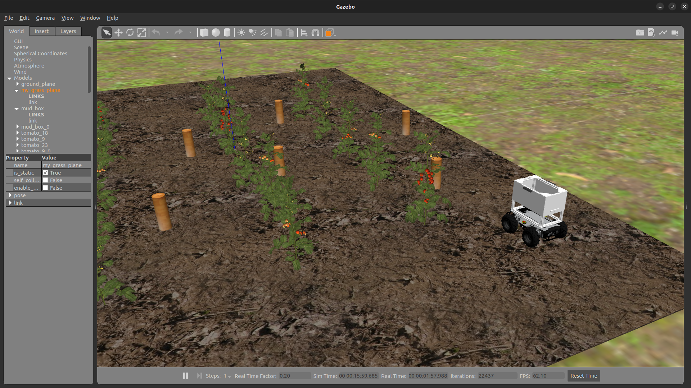
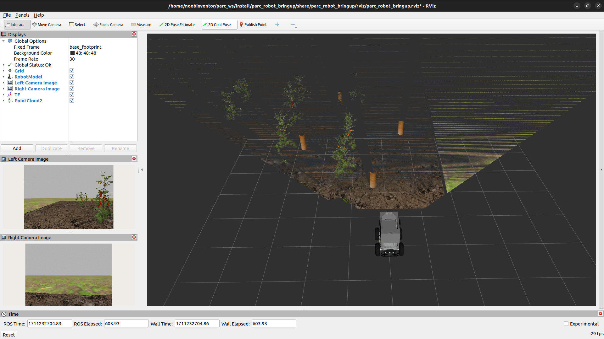

# Comment configurer votre espace de travail


Dans ce didacticiel, vous allez configurer un répertoire sur votre PC compatible ROS comme espace de travail pour le développement et installer les packages ROS concurrents. Veuillez suivre attentivement les instructions ci-dessous.

!!! note
     Ceci peut être effectué UNIQUEMENT après avoir configuré votre PC (en suivant le tutoriel ici : [Configuration de votre PC](../getting-started-tutorials/setting-up-your-pc.md)).

!!! note
     Si vous utilisez un conteneur Docker, vous pouvez ignorer ce didacticiel et suivre les instructions de [Configuration de votre PC à l'aide de Docker](../getting-started-tutorials/setting-up-with-docker.md) à la place.

### Étape 1 : Configurer l'espace de travail ROS

<!-- Premièrement, nous créons un nouveau répertoire dans votre répertoire personnel appelé `catkin_ws` avec un sous-répertoire `src`. Ensuite, nous initialisons le répertoire en tant qu'espace de travail catkin. -->

Ouvrez un nouveau terminal sur votre PC, puis copiez et collez la ligne suivante à la fois :
```sh
mkdir -p ~/catkin_ws/src
cd ~/catkin_ws/src
catkin_init_workspace
```


### Étape 2 : Cloner le dépôt

Dans le même terminal (ou dans un nouveau), copiez et collez ce qui suit :
```sh
cd ~/catkin_ws/src
git clone --recurse-submodules https://github.com/PARC-Robotics/PARC-Engineers-League.git
```
Ou si vous avez déjà cloné le référentiel sans sous-modules, exécutez la commande `git submodule update --init --recursive` pour les mettre à jour.

### Étape 3 : Installer les dépendances

Dans le même terminal (ou dans un nouveau), copiez et collez ce qui suit :
```sh
cd ~/catkin_ws
mise à jour sudo apt
rosdep install --from-paths ./src --ignore-src -y
```

!!! Avertissement
     Il existe un problème connu avec l'une de nos dépendances qui peut entraîner l'échec de la commande `rosdep`. Si vous rencontrez ce problème, installez manuellement la dépendance en exécutant la commande suivante :
     ```sh
     sudo apt install ros-noetic-teleop-twist-keyboard ros-noetic-hector-gazebo-plugins libasio-dev
     ```

### Étape 4 : Compiler les packages
```sh
cd ~/catkin_ws
faire des chatons
source ~/catkin_ws/devel/setup.bash
```


### Étape 5 : Configurer l'environnement ROS
Pour définir l'environnement à chaque fois que vous lancez un nouveau terminal, suivez cette commande :

```sh
echo "source ~/catkin_ws/devel/setup.bash" >> ~/.bashrc
source ~/.bashrc
```
!!! note
     Au fur et à mesure que vous développez, il est bon de définir les variables d'environnement chaque fois que vous exécutez une commande `catkin_make` pour compiler les modifications apportées à vos packages. Vous pouvez le faire en :
     ```sh
     source ~/catkin_ws/devel/setup.bash
     ```


### Étape 6 : testez l'installation

Si vous avez terminé les tâches précédentes avec succès, vous devriez pouvoir exécuter cette commande de lancement ROS et voir le simulateur Gazebo et le simulateur RViz s'ouvrir avec l'affichage suivant :
```sh
roslaunch parc_robot task2.launch
```

Fenêtre du simulateur de belvédère



Fenêtre RViz


Si vous exécutez la commande suivante dans un nouveau terminal,
```
rqt_graph
```
Vous verrez un écran comme celui-ci :


Vous devez `publier`/écrire dans le `sujet` `/cmd_vel` pour déplacer le robot.
Le guide suivant vous aidera à contrôler le robot à l'aide du clavier. Une fois que vous avez testé cela, vous pouvez suivre le guide [understanding-ros](../getting-started-with-ros) pour écrire un programme python pour contrôler le robot.

### Étape 7 : Contrôler le robot à l'aide du clavier
Exécutez la commande suivante dans un nouveau terminal
```sh
source ~/catkin_ws/devel/setup.bash
roslaunch parc_robot teleop.launch
```

Maintenant, en gardant le deuxième terminal en haut (teleop.launch), appuyez sur `i` pour faire avancer le robot, vous pouvez voir le robot se déplacer dans les fenêtres "RViz" et "Gazebo".
vous pouvez utiliser les touches ci-dessous pour déplacer le robot et la touche "k" pour arrêter le mouvement.

```sh
Se déplacer :
   u    i    o
   j    k    l
   m    ,    .
```