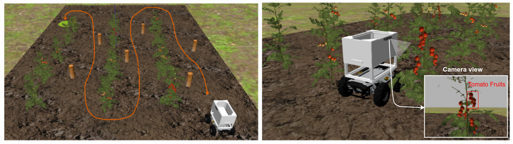

# Introduction

La robotique et l'IA révolutionnent le quoi et comment nous travaillons aujourd'hui et continuerons à l'avenir. Aujourd'hui, les robots augmentent la capacité des travailleurs humains dans diverses industries: logistique, soins de santé, agriculture, etc.

Avec la croissance de l'insécurité alimentaire mondiale et les pressions du changement climatique, il est plus important que jamais de développer de nouvelles approches de l'agriculture durable. La Ligue des ingénieurs Parc 2023 invite les équipes à réinventer comment la robotique et l'IA peuvent ouvrir la voie à un avenir agricole plus durable pour l'Afrique.

Le défi de la concurrence est de créer des logiciels pour faire fonctionner le **PARC AgRobot** (un robot mobile à roues) pour effectuer des tâches agricoles autonomes, notamment: la navigation précise dans une ferme, détectant les mauvaises herbes dans les lignes de culture en utilisant la vision informatique et la plantation de graines de plantation de manière autonome sur la ferme.

La compétition se compose de deux phases: la **Phase de Simulation** et la **Phase Réelle**.

## Phase de Simulation
Dans cette phase, les équipes travailleront avec le **PARC AgRobot** en simulation (en utilisant le simulateur de robot Gazebo) et utiliseront des outils de pointe (par exemple, ROS, Matlab, OpenCV, etc.) pour développer des solutions à Effectuez deux tâches fondamentales pour les robots agricoles:

* Navigation sur le terrain autonome
* Détection des mauvaises herbes

Cette phase est entièrement virtuelle. Les équipes participantes suivront les instructions de cette documentation pour configurer leurs PC et télécharger les packages de simulation complets nécessaires pour effectuer les tâches.
Les équipes sont tenues de terminer et de télécharger leurs solutions au plus tard dans la date limite de phase 1. Après les évaluations d'équipes, les équipes les plus performantes se qualifieront pour concourir dans la phase 2: **Phase Réelle**.

## Phase Réelle
Cette phase aura lieu en personne au Sénégal en juillet 2023. Les équipes auront la possibilité d'intégrer leur système de logiciel physique **PARC AgRobot** et rivaliseront dans une ferme partenaire pour la compétition finale.

## Prises et récompenses

Les équipes les plus performantes de la compétition finale recevront des prix et des opportunités de mentorat de nos sponsors. Tous les participants recevront un certificat de participation.