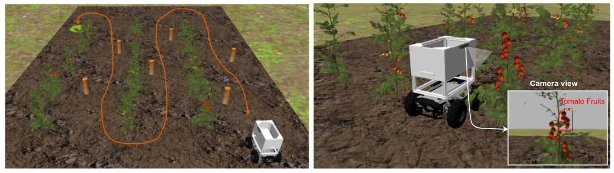

# Introduction

<!-- Talk about increasing population and need for food security on the continent. Applying robotics and AI to monitor and boost crop yields. -->

The PARC Engineers League invites participants to reimagine how robots can augment the capabilities of human labor in a task of growing prevalence - autonomous farming.

With growing global food insecurity and pressures from climate change, it is more important than ever to develop novel approaches to sustainable agriculture. Maintaing the sustainable agriculture theme from the previous year, the 2024 PARC Engineers League invites teams to reimagine how robotics and AI can steer the way to a more sustainable agriculture future for Africa. 

The challenge of the competition is to build software to operate the **PARC AgRobot** (a wheeled mobile robot) to perform autonomous agricultural tasks including: precise navigation through a tomato field, and determining the crop yield of the field by detecting the fruits on each tomato plant using computer vision. 

The competition consists of two phases: the **Simulation Phase** and the **Real World Phase**.

## Simulation Phase
<!-- In this phase, teams would interact with the **PARC AgRobot** in simulation (using the Gazebo Robot Simulator). Participants are required to write software to complete three fundamental tasks for agricultural robots: -->
In this phase, teams will work with the **PARC AgRobot** in simulation (using the Gazebo Robot Simulator) and use state-of-the-art tools (e.g., ROS, OpenCV, etc.) to develop solutions to complete two fundamental tasks for agricultural robots:

* Autonomous field navigation
* Crop yield estimation

This phase is fully virtual. Participating teams will follow the instructions in this documentation to set up their PCs and download the complete simulation packages required to complete the tasks. 
Teams are required to complete and upload their solutions on or before the Phase 1 deadline. Following team evaluations, best performing teams will qualify to compete in Phase 2: **Real World Phase**.

## Real World Phase

<!--  -->

This phase will take place in-person in Senegal in July 2024. Teams will get the opportunity to integrate their software physical **PARC AgRobot** system and compete in a partner farm for the final competition.

## Prizes & Awards

Top performing teams in the final competition will receive prizes and mentoring opportunities from our sponsors. All participants will receive a certificate of participation.
